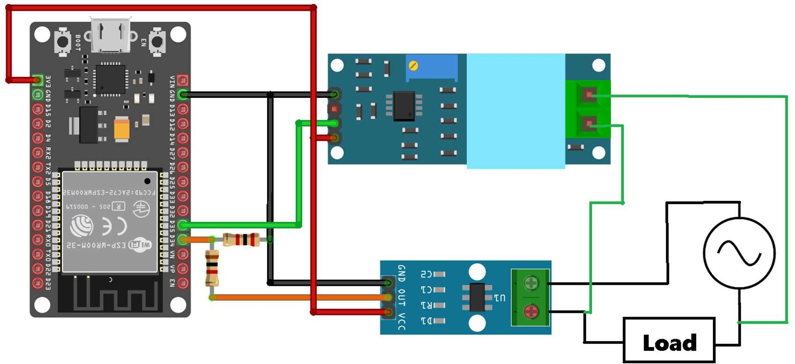
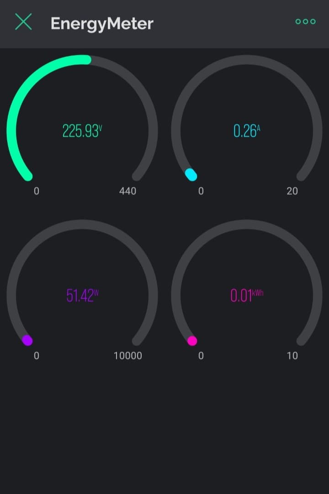
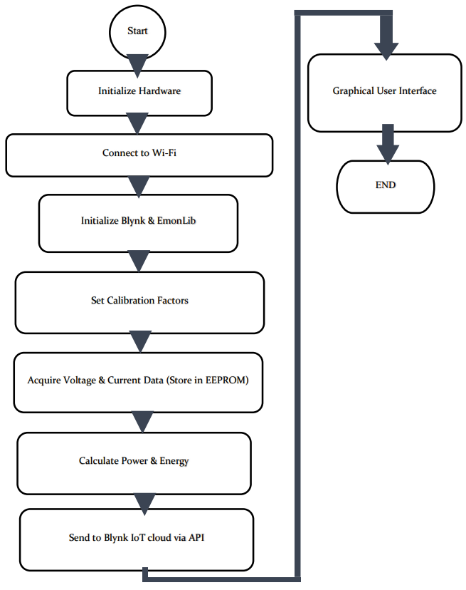

# ESP32 Energy Meter

## Project Overview
This project is an IoT-based energy meter designed for real-time monitoring of electrical power consumption. Using an ESP32 DevKit, the system measures current and voltage, computes power and energy usage, and sends the data to a remote Blynk dashboard for visualization. It employs an **ACS712 current sensor** and a **ZMPT101B voltage sensor** to accurately capture the power consumption details of an AC electrical load.

## Key Features
- **Real-Time Monitoring:** Measure and display real-time values of voltage, current, power, and energy consumption.
- **Blynk Dashboard Integration:** Visualize live data remotely using the Blynk IoT platform.
- **Accurate Measurements:** Utilizes calibrated sensors for precise readings.
- **Wi-Fi Connectivity:** Data transmission to the Blynk cloud via Wi-Fi.

---

## Components Required
- **ESP32 DevKit Board**
- **ACS712 Current Sensor (20A or 30A)**
- **ZMPT101B Voltage Sensor Module**
- **Blynk IoT Platform Account**
- **Breadboard and Jumper Wires**
- **AC Load and Power Supply**

---

## System Architecture
1. **Current Measurement:**  
   The ACS712 current sensor detects the current flowing through an AC load and outputs an analog signal proportional to the current.

2. **Voltage Measurement:**  
   The ZMPT101B voltage sensor converts the AC mains voltage into a scaled-down analog signal that the ESP32 can read.

3. **ESP32 Processing:**  
   The ESP32 processes the analog signals to compute RMS voltage, RMS current, and power. The accumulated energy consumption (in kWh) is calculated over time.

4. **Data Transmission:**  
   Processed data is sent to the Blynk cloud using Wi-Fi, where it can be viewed on a Blynk dashboard.

---

## Circuit Diagram


### **Connections:**
- **ACS712 Current Sensor:**
  - **VCC:** Connect to ESP32 **3.3V**
  - **GND:** Connect to ESP32 **GND**
  - **OUT:** Connect to ESP32 **Pin 34**

- **ZMPT101B Voltage Sensor:**
  - **VCC:** Connect to ESP32 **3.3V**
  - **GND:** Connect to ESP32 **GND**
  - **OUT:** Connect to ESP32 **Pin 35**

- **ESP32 to Blynk Dashboard:**  
  The ESP32 connects to the Blynk cloud via Wi-Fi to transmit sensor data.

---

## Blynk Dashboard and Flowchart
<div align="center">
   <table>
     <tr>
       <td align="center">
         
       </td>
       <td align="center">
         
       </td>
     </tr>
   </table>
</div>

### **Steps to Configure Blynk:**
1. **Create a new Blynk project.**
2. **Add the following widgets:**
   - **Gauge Widget for Voltage (V):** Map to virtual pin **V0**.
   - **Gauge Widget for Current (A):** Map to virtual pin **V1**.
   - **Gauge Widget for Power (W):** Map to virtual pin **V2**.
   - **Value Display Widget for Energy (kWh):** Map to virtual pin **V3**.

3. **Obtain the Blynk Auth Token** and paste it into the code:
   ```cpp
   char auth[] = "Your_Blynk_Auth_Token";
   ```

---

## Software Setup

### **Required Libraries:**
- **Blynk:** To communicate with the Blynk cloud.
- **EmonLib:** For energy monitoring calculations.
  
### **Installation Steps:**
1. **Install the [Arduino IDE](https://www.arduino.cc/en/software).**
2. **Add ESP32 Board Support:**  
   Go to **File > Preferences**, add the following URL:  
   ```
   https://dl.espressif.com/dl/package_esp32_index.json
   ```
3. **Install Libraries:**
   - Open the Arduino IDE and install **Blynk** and **EmonLib** from the Library Manager.

### **Code Deployment:**
1. **Open `EnergyMeter.ino`** in the Arduino IDE.
2. **Update Wi-Fi Credentials:**
   ```cpp
   char ssid[] = "Your_WiFi_SSID";
   char pass[] = "Your_WiFi_Password";
   ```
3. **Upload the code** to your ESP32 board.

---

## Code Explanation

### **Core Functions:**
1. **`getCurrent()` Function:**
   - Reads analog data from the ACS712 sensor.
   - Computes RMS current and power:
     ```cpp
     Voltage = getVPP();
     VRMS = (Voltage / 2.0) * 0.707;
     AmpsRMS = ((VRMS * 1000) / mVperAmp);
     Watt = (AmpsRMS * 240 / 1.2);
     ```

2. **`getVPP()` Function:**
   - Measures the voltage peak-to-peak value:
     ```cpp
     result = ((maxValue - minValue) * 3.3) / 4096.0;
     ```

3. **`myTimerEvent()` Function:**
   - Reads current and voltage data at regular intervals.
   - Calculates energy consumption and sends data to Blynk:
     ```cpp
     kWh = kWh + power * (millis() - lastmillis) / 3600000000.0;
     Blynk.virtualWrite(V0, emon.Vrms);
     Blynk.virtualWrite(V1, irms);
     Blynk.virtualWrite(V2, power);
     Blynk.virtualWrite(V3, kWh);
     ```

---

## Troubleshooting

1. **Incorrect Readings:**
   - Ensure correct sensor calibration.
   - Verify proper connections of the ACS712 and ZMPT101B sensors.

2. **Wi-Fi Connectivity Issues:**
   - Double-check Wi-Fi credentials.
   - Ensure ESP32 is within range of the Wi-Fi router.

3. **No Data on Blynk Dashboard:**
   - Confirm Blynk Auth Token is correct.
   - Check if the ESP32 is connected to Wi-Fi (monitor via the serial terminal).

---

## Future Enhancements
- Add support for three-phase power monitoring.
- Implement data logging with timestamps.
- Develop a web-based interface for better data visualization.

---
